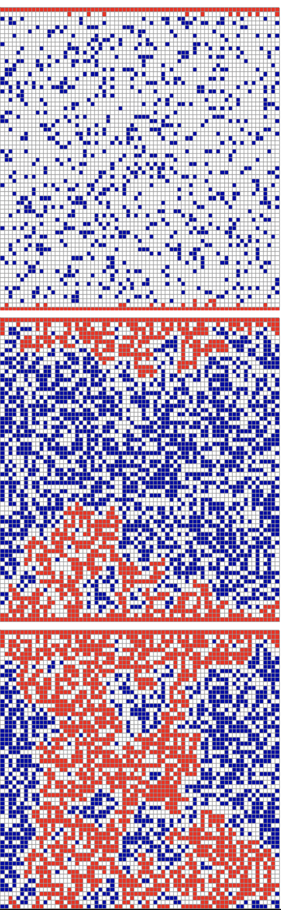

# Percolation

This repo contains the code for the study of the percolation problem on a 2D wall. 

Our percolation model is quite simple: given a M * N binary matrix, we have to determine whether the fluid can get to the bottom of the wall. We assume that the fluid can only move vertically or horizontally to neighbouring cells with positive values. Moreover, the fluid starts at the top of the wall along its entire length.

First, for a given binary matrix, we determine if the liquid can percolate with 3 different algorithmic techniques: 

-Depth First Search: the matrix is explored depth first to find a runaway for the liquid.

-Breadth First Search: the matrix is explored breadth first to find a runaway for the liquid.

-Union Find data structure: each cell is assigned to its connected compoenent in the graph.

Furthermore, for a given matrix size M * N, we can carry out statistical tests to estimate the probability of percolation, assuming that each cell of the wall is distributed as a Bernoulli random variable with parameter *p*. As expectd, we find out that the probability of percolation increases with N and p, but decreases with M. The taller and the thinner the matrix, the slimmer the chance for the fluid to percolate.

Finally, for a given matrix size M * N, we compute the exact probability of percolation, by testing our model on all possible binary matrices with size M * N. These matrices are generated with backtracking. For this last idea, which is implemented in the file *simulate.cpp*, we must keep in mind that the number of binary matrices of size M * N is 2^(M * N), which makes the runtime of this program exponential in the size of the matrices.

